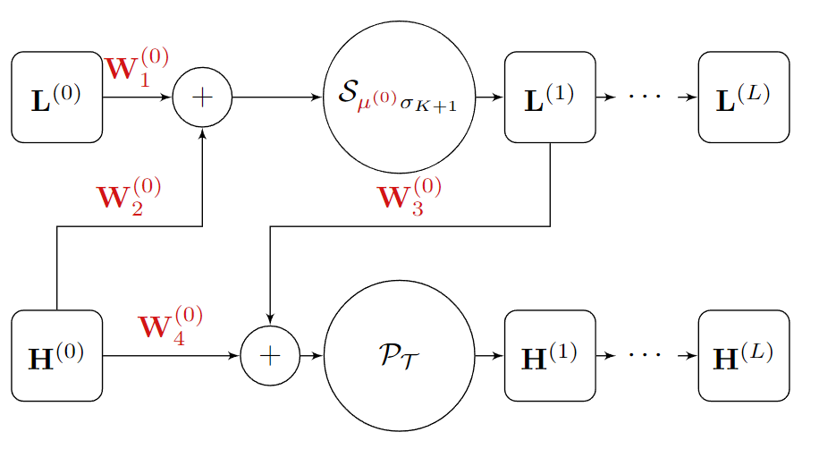

# Deep Unfolded Projected Wirtinger Gradient Descent (Deep Unfolded PWGD)

DESCRIPTION


<p align="center">
    
</p>


## Training
First, start the ``visdom.server`` for visualisation during training.
```shell
python -m visdom.server
```


```shell
python main.py --output_dir ./test/afLoss --data_dir ../dataset/ --loss_fn afLoss
 --model UnfoldedPWGD --N 21 --P 20 --K 2 --P_rank_method rankK --c_mn_filename c_mn.mat
```